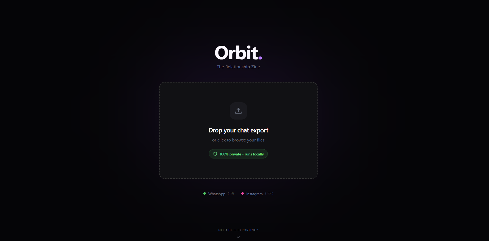
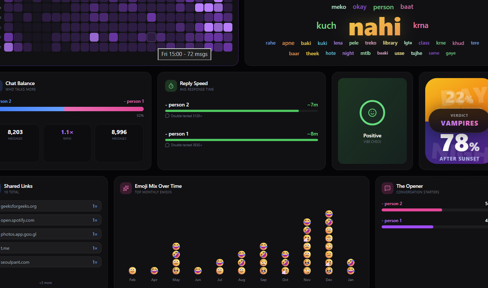
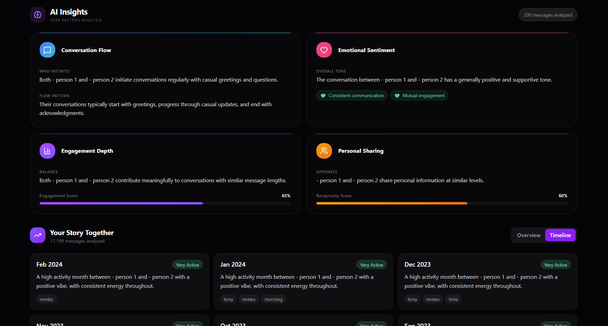

<h1 align="center">Orbit</h1>
<p align="center"><strong>The Relationship Zine</strong></p>

<p align="center">
  <em>Turn your chat exports into beautiful, AI-powered relationship analytics</em>
</p>

<p align="center">
  <a href="#features">Features</a> •
  <a href="#screenshots">Screenshots</a> •
  <a href="#quick-start">Quick Start</a> •
  <a href="#architecture">Architecture</a> •
  <a href="#api">API</a>
</p>

---

## ✨ Features

### 📊 15 Analytics Cards
Transform your conversations into stunning visual insights:

| Card | Description |
|------|-------------|
| **Summary** | Total messages, days together, conversation overview |
| **Trend** | Message activity over time with interactive charts |
| **Streak** | Current and longest conversation streaks |
| **Activity Heatmap** | Hour-by-day message distribution visualization |
| **Word Cloud** | Most used words displayed beautifully |
| **Engagement** | Chat balance and participation metrics |
| **Reply Timing** | Average response times per participant |
| **Aura** | Conversation vibe and mood analysis |
| **Rhythm** | Day vs Night messaging patterns (Vampires vs Early Birds) |
| **Links** | Most shared URLs and domains |
| **Emoji Timeline** | Emoji usage patterns over time |
| **Initiator** | Who starts conversations more often |
| **AI Insights** | Deep conversation analysis (4 categories) |
| **Model Selector** | Choose between Cloud (Fast/DeepSeek) or Offline (Private/Ollama) |
| **Social Sharing** | Export high-quality PNG receipts for Instagram/Twitter |

### 🤖 AI-Powered Insights
Get deep, meaningful analysis across 4 categories:

- **🗣️ Conversation Flow** — Who initiates, topic patterns, conversation dynamics
- **❤️ Emotional Sentiment** — Tone analysis, health assessment, red/green flags
- **⚡ Engagement Depth** — Effort balance, investment comparison, engagement score
- **🤝 Personal Sharing** — Openness levels, question balance, reciprocity score

### 🎨 Premium UI/UX
- **Dark Mode** — Easy on the eyes, stunning visuals
- **Glassmorphism** — Modern frosted glass effects
- **Smooth Animations** — Powered by Framer Motion
- **Bento Grid Layout** — Beautiful card organization
- **Aurora Text Effects** — Dynamic gradient text animations

### 🔒 Privacy First
- **100% Local Processing** — Your data never leaves your machine
- **No Cloud Upload** — Everything runs on your computer
- **Session Storage** — Data cleared when you close the browser
- **No Accounts Required** — Just drop your file and go

---

## 📸 Screenshots

### Upload Interface
<p align="center">
  
</p>
<p align="center"><em>Drag & drop your chat export with built-in export guides for WhatsApp & Instagram</em></p>

### Analytics Dashboard
<p align="center">
  
</p>
<p align="center"><em>Bento grid layout with 15 interactive analytics cards</em></p>

### AI Insights
<p align="center">
  
</p>
<p align="center"><em>Deep AI analysis with emoji timelines, conversation flow, and emotional sentiment</em></p>

---

## 🚀 Quick Start

### Prerequisites
- **Node.js** 18+ 
- **Python** 3.10+
- **Ollama** (for AI features): https://ollama.ai

### 1. Install Ollama & Pull Model
```bash
# Install Ollama from https://ollama.ai
# Then pull the model:
ollama pull qwen2.5:0.5b
```

### 2. Start Backend
```bash
cd backend
python -m venv venv
.\venv\Scripts\activate  # Windows
# source venv/bin/activate  # Mac/Linux

pip install -r requirements.txt
uvicorn app.main:app --reload --host 0.0.0.0 --port 8000
```

### 3. Start Frontend
```bash
cd frontend
npm install
npm run dev
```

### 4. Open App
- **Frontend**: http://localhost:3000
- **API Docs**: http://localhost:8000/docs

---

## 🏗️ Architecture

```
┌─────────────────────────────────────────────────────────────┐
│   Presentation Tier   │   Application Tier   │  Data Tier  │
│      (Next.js 15)     │      (FastAPI)       │  (SQLite)   │
│      Port 3000        │      Port 8000       │             │
└─────────────────────────────────────────────────────────────┘
          │                      │                    │
          │      REST API        │       ORM          │
          └──────────────────────┴────────────────────┘
                          │
                       Ollama
                    (Local AI)
```

### Tech Stack

| Layer | Technology |
|-------|------------|
| **Frontend** | Next.js 15, React 19, TypeScript, Tailwind CSS |
| **State** | Zustand with session persistence |
| **Animations** | Framer Motion |
| **Charts** | Recharts |
| **Backend** | FastAPI, Python 3.10+ |
| **Database** | SQLite (dev) / PostgreSQL (prod) |
| **ORM** | SQLAlchemy |
| **AI** | Ollama (qwen2.5:0.5b) |

---

## 📁 Project Structure

```
/
├── frontend/                 # Next.js Application
│   ├── src/
│   │   ├── components/
│   │   │   ├── cards/        # 15 analytics cards
│   │   │   ├── expanded/     # Expanded detail views
│   │   │   └── ui/           # Shared UI components
│   │   ├── app/              # Pages (Home, Report)
│   │   ├── lib/              # API client
│   │   └── store/            # Zustand state
│   └── package.json
│
├── backend/                  # FastAPI Application  
│   ├── app/
│   │   ├── api/              # REST Endpoints
│   │   ├── core/             # Configuration
│   │   ├── db/               # SQLAlchemy models
│   │   └── services/
│   │       ├── parser.py         # WhatsApp/Instagram parsing
│   │       ├── stats.py          # Statistical computations
│   │       ├── ai_engine.py      # Ollama AI analysis
│   │       └── text_optimizer.py # Token optimization
│   └── requirements.txt
│
├── assets/                   # Screenshots & media
├── docker-compose.yml        # Docker orchestration
└── README.md
```

---

## 🔌 API Endpoints

| Method | Endpoint | Description |
|--------|----------|-------------|
| `POST` | `/api/v1/upload` | Upload chat file, returns stats |
| `GET` | `/api/v1/stats/{id}` | Get computed statistics |
| `POST` | `/api/v1/ai/preflight` | Check AI model availability & rate limits |
| `POST` | `/api/v1/ai/init` | Initialize AI engine |
| `POST` | `/api/v1/ai/analyze` | Run full AI analysis |
| `GET` | `/api/v1/ai/insights/{id}` | Get cached AI insights |
| `POST` | `/api/v1/search` | Search messages with filters |
| `POST` | `/api/v1/export/download_image` | Generate and download social receipt image |

---

## 📱 Supported Formats

| Platform | Format | How to Export |
|----------|--------|---------------|
| **WhatsApp** | `.txt` | Chat → ⋮ More → Export Chat → Without Media |
| **Instagram** | `.json` | Settings → Your Activity → Download Your Information |

---

## 🤖 How AI Works

1. **Sampling** — Extracts up to 500 representative messages using stratified sampling
2. **Context** — Processes ~15,000 characters (~4k tokens) of conversation
3. **Selection** — Choose between **Cloud** (DeepSeek V3 via API) or **Offline** (Local Ollama)
4. **Pre-flight** — Automatically checks model availability and rate limits before analysis
5. **Analysis** — Generates insights using the selected model
6. **Insights** — Generates structured analysis across 4 categories

---

## 🐳 Docker Deployment

```bash
# Build and run all services
docker-compose up --build

# Services:
# - Frontend: http://localhost:3000
# - Backend: http://localhost:8000
# - Postgres: localhost:5432
```

---

## 🛠️ Development

### Environment Variables

**Backend** (`backend/.env`):
```env
DATABASE_URL=sqlite:///./orbit.db
# For Docker: postgresql://postgres:orbit_secret@db:5432/orbit
```

**Frontend** (`frontend/.env.local`):
```env
NEXT_PUBLIC_API_URL=http://localhost:8000
```

---

## 📄 License

MIT License - feel free to use and modify!

---

<p align="center">
  <strong>Built with ❤️ using Next.js, FastAPI, and Ollama</strong>
</p>

<p align="center">
  <sub>Turn your conversations into insights ✨</sub>
</p>
