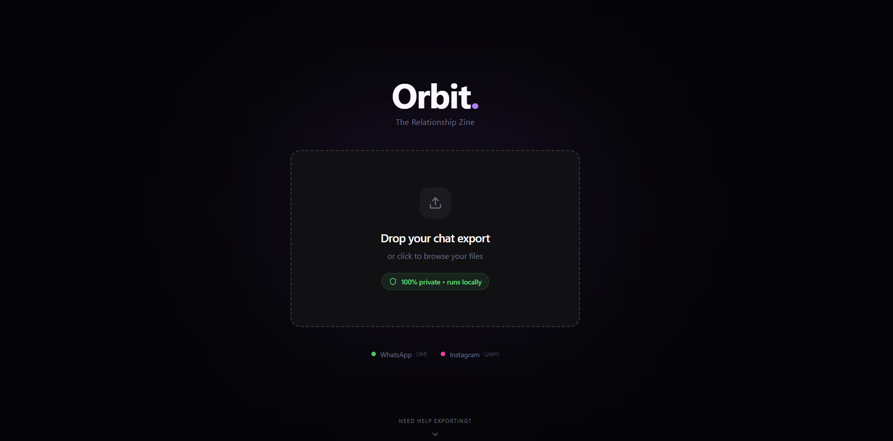
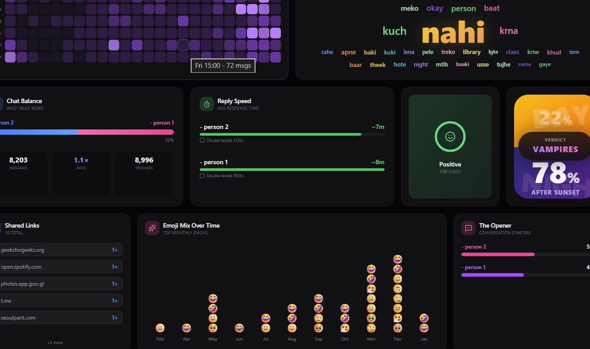
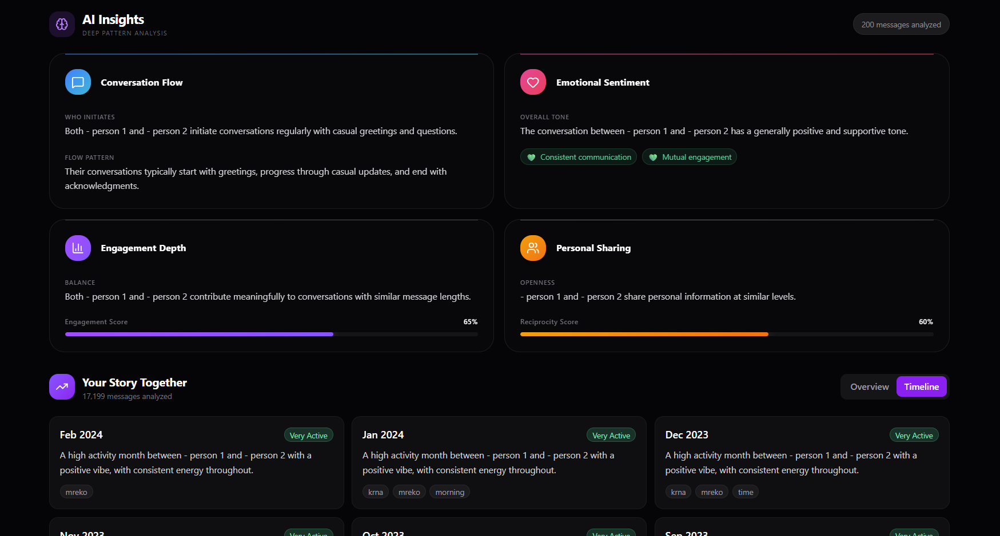

<h1 align="center">Orbit</h1>

<p align="center">
  <em>Turn raw chat exports into beautiful, private, AI-powered relationship insights.</em>
</p>

<p align="center">
  <a href="#why-orbit">Why Orbit</a> •
  <a href="#what-you-get">What You Get</a> •
  <a href="#screenshots">Screenshots</a> •
  <a href="#quick-start">Quick Start</a> •
  <a href="#architecture">Architecture</a> •
  <a href="#api">API</a>
</p>

---

## Why Orbit?

Chats hold years of memories, patterns, effort, silence, emotion —  
but they’re locked inside messy message logs.

**Orbit turns conversations into clarity.**

Upload a WhatsApp or Instagram chat export and Orbit transforms it into:
- meaningful analytics
- emotional patterns
- conversation dynamics
- and shareable visual summaries

All **locally**, with **zero cloud uploads**, and **no accounts**.

This isn’t surveillance.  
It’s reflection.

---

## What You Get

### 📊 Relationship Analytics (Visual & Intuitive)
Orbit generates a rich analytics dashboard that helps you understand:
- how often you talk — and when
- who initiates conversations
- response patterns and effort balance
- streaks, activity cycles, and engagement rhythm

Everything is presented as **beautiful, interactive cards**, designed to feel more like a magazine than a spreadsheet.

---

### 🤖 AI-Powered Insights (Optional & Private)
When enabled, Orbit runs **local or cloud-based AI analysis** to uncover deeper patterns:

- **Conversation Flow**  
  Who drives the conversation? How topics evolve over time.

- **Emotional Sentiment**  
  Overall tone, emotional balance, and potential red/green flags.

- **Engagement Depth**  
  Effort comparison, reciprocity, and long-term investment patterns.

- **Personal Sharing**  
  Openness, question balance, and mutual vulnerability signals.

AI runs **only when you ask for it**, with automatic pre-flight checks and strict token limits.

---

### 🎨 Designed Like a Premium Product
Orbit isn’t a data dump — it’s crafted.

- Dark-mode-first, easy on the eyes
- Glassmorphism & bento-grid layouts
- Smooth animations with Framer Motion
- High-quality PNG exports for social sharing
- Thoughtful typography and spacing throughout

It feels intentional, because it is.

---

### 🔒 Privacy Is Not a Feature — It’s the Default
- 100% local processing
- No cloud uploads
- No accounts, no tracking
- Session-based storage (data disappears when you close the tab)

Your conversations stay yours.

---

## 📸 Screenshots

### Upload Interface
<p align="center">
  
</p>
<p align="center"><em>Drag & drop chat exports with built-in guides for WhatsApp and Instagram</em></p>

### Analytics Dashboard
<p align="center">
  
</p>
<p align="center"><em>Bento-style dashboard with interactive analytics cards</em></p>

### AI Insights
<p align="center">
  
</p>
<p align="center"><em>Deep AI analysis with emotion, flow, and engagement breakdowns</em></p>


## 

## 🚀 Quick Start
 

### Prerequisites
- **Node.js** 18+
- **Python** 3.10+
- **Ollama** (for local AI): https://ollama.ai

---

### 1. Install Ollama & Pull Model

```bash
ollama pull qwen2.5:0.5b
```

---

### 2. Start Backend

```bash
cd backend
python -m venv venv

# Windows
.\venv\Scripts\activate

# macOS / Linux
source venv/bin/activate

pip install -r requirements.txt
uvicorn app.main:app --reload --host 0.0.0.0 --port 8000
```

---

### 3. Start Frontend

```bash
cd frontend
npm install
npm run dev
```

---

### 4. Open App

* Frontend: [http://localhost:3000](http://localhost:3000)
* API Docs: [http://localhost:8000/docs](http://localhost:8000/docs)

---

## Architecture

```
┌───────────────────────────────────────────────────────────┐
│  Presentation Tier   │  Application Tier   │   Data Tier  │
│     (Next.js 15)     │     (FastAPI)       │   (SQLite)   │
│     Port 3000        │     Port 8000       │              │
└───────────────────────────────────────────────────────────┘
           │                   │                  │
           │      REST API     │       ORM        │
           └───────────────────┴──────────────────┘
                         │
                      Ollama
                   (Local AI)
```

---

## Tech Stack

* Frontend: Next.js 15, React 19, TypeScript, Tailwind CSS
* State: Zustand (session‑based)
* Animations: Framer Motion
* Charts: Recharts
* Backend: FastAPI, Python 3.10+
* Database: SQLite (dev) / PostgreSQL (prod)
* ORM: SQLAlchemy
* AI: Ollama (qwen2.5:0.5b)

---

## API Overview

* POST `/api/v1/upload` — upload chat export
* GET `/api/v1/stats/{id}` — retrieve analytics
* POST `/api/v1/ai/analyze` — run AI insights
* POST `/api/v1/export/download_image` — generate PNG export

---

## License

MIT — use it, remix it, ship it.

---

**Orbit isn’t about reading chats.**

*It’s about understanding what they say over time.*
